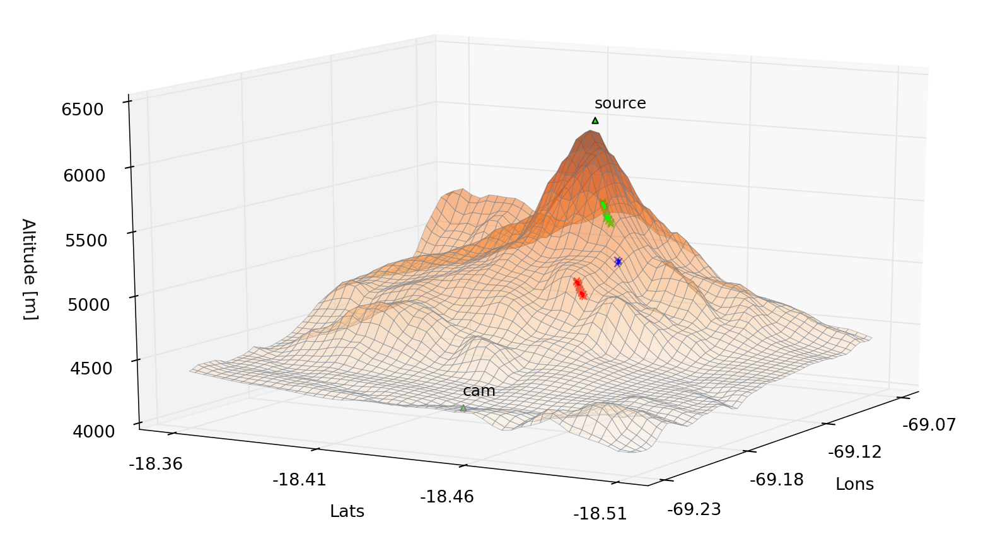

.. geonum documentation master file, created by
   sphinx-quickstart on Tue Nov 15 09:36:44 2016.
   You can adapt this file completely to your liking, but it should at least
   contain the root `toctree` directive.

|CI| |docs| |cov| |code-quality|

Welcome to geonum
=================

GitHub: https://github.com/jgliss/geonum

  Automatic retrieval of topographic distances (example showing Guallatiri volcano, Chile)

**Contents:**

.. toctree::
   :maxdepth: 4

   intro
   install
   examples
   auto_examples/index
   api
   upcoming

Indices and tables
==================

* :ref:`genindex`
* :ref:`modindex`
* :ref:`search`

.. |CI| image:: https://github.com/jgliss/geonum/actions/workflows/CI.yml/badge.svg
    :target: https://github.com/jgliss/geonum/actions/

.. |docs| image:: https://readthedocs.org/projects/geonum/badge/?version=latest
    :target: https://geonum.readthedocs.io/en/latest/?badge=latest

.. |cov| image:: https://codecov.io/gh/jgliss/geonum/branch/main-dev/graph/badge.svg?token=802DAZA1W9
    :target: https://codecov.io/gh/jgliss/geonum

.. |code-quality| image:: https://www.codefactor.io/repository/github/jgliss/geonum/badge
   :target: https://www.codefactor.io/repository/github/jgliss/geonum
   :alt: Code quality